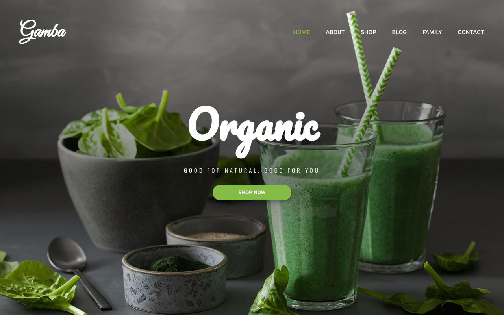

<h1 align="center">Gamba, Website for Selling Organic Products</h1>

  <h2>
    <a href="https://gamba.vercel.app/" target="_blank">Demo</a>
  </h2>

<!-- TABLE OF CONTENTS -->

## Table of Contents

- [Overview](#overview)
  - [Built With](#built-with)
- [Features](#features)
- [Contact](#contact)

<!-- OVERVIEW -->

## Overview

### Built With

- [HTML5](https://developer.mozilla.org/en-US/docs/Web/Guide/HTML/HTML5)
- [CSS](https://developer.mozilla.org/en-US/docs/Web/CSS)
- [SASS](https://sass-lang.com/)

## Features

This application/site was created to improve my CSS skills such as : 
  - grid layout, flexbox, using svg sprites, setting up a simple build process with NPM scripts
  - using SASS for CSS preprocessor, using BEM methodology for naming CSS classes
  - Responsive website design, and other advanced CSS properties.

## Contact

- GitHub : [@nggar](https://github.com/nggar)
- Gmail : jihandokoengg@gmail.com
